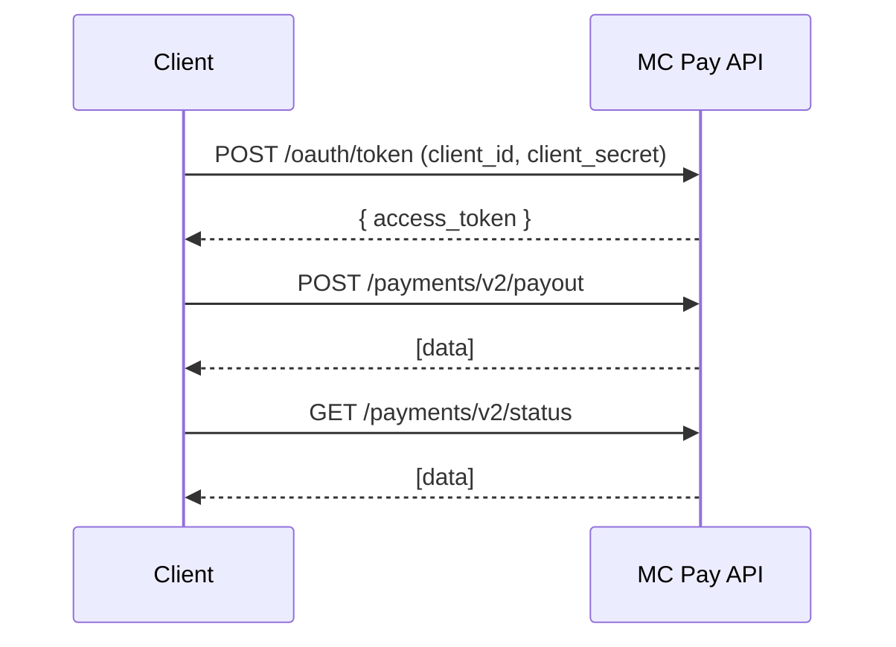

# B2P Payments

You can execute requests to create transactions for your users within MC Pay.

## Rate limits
All API requests to B2P payments is 300 requests per minute

## Authorization

All API requests require authorization using OAuth 2.0 (`partner` grant). For more details, refer to the [OAuth 2.0 Authorization Server API
](OAuth.md).

## B2P Payments Workflow
1. **Create Bulk B2P Payments**\
   `POST /payments/v2/payout` (up to 50 payments) — Creates Bulk B2P Payments **synchronously**.

2. **Check Bulk B2P Payment status**\
   `GET /payments/v2/status` —   Retrieve the status of the payout batch using its `request_id`.

### B2P Payment Sequence

