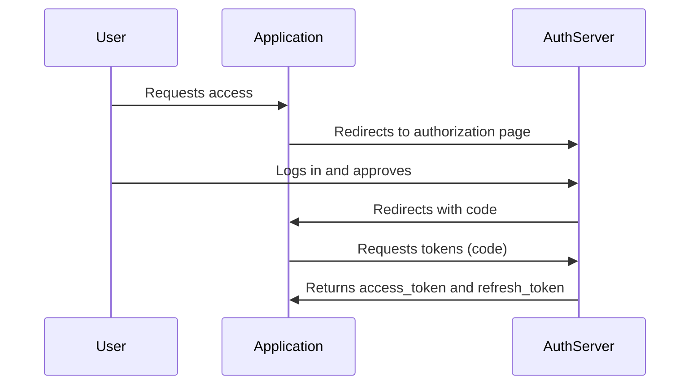

# OAuth 2.0 Authorization Server API

## Introduction

This document describes the authorization process using the `authorization_code` grant type in OAuth 2.0. This method is used to obtain an access token after the user successfully authorizes the application. Code samples can be found at Cookbook section. 

## `authorization_code` Grant Flow

### Steps in the Process

1. The **Application** redirects the user to the authorization server.
2. The **User** logs in and approves the request on the authorization server.
3. The **Authorization Server** redirects the user back to the client with an `code`.
4. The **Application** exchanges the `code` for an `access_token`.
5. The **Authorization Server** returns the tokens to the client.

### Sequence Diagram

## `partner` Grant Flow

Fetch API tokens via `POST /oauth/tokens`, see Cookbook Payments section for examples
