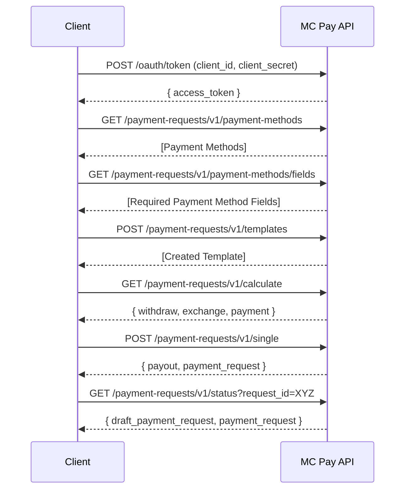
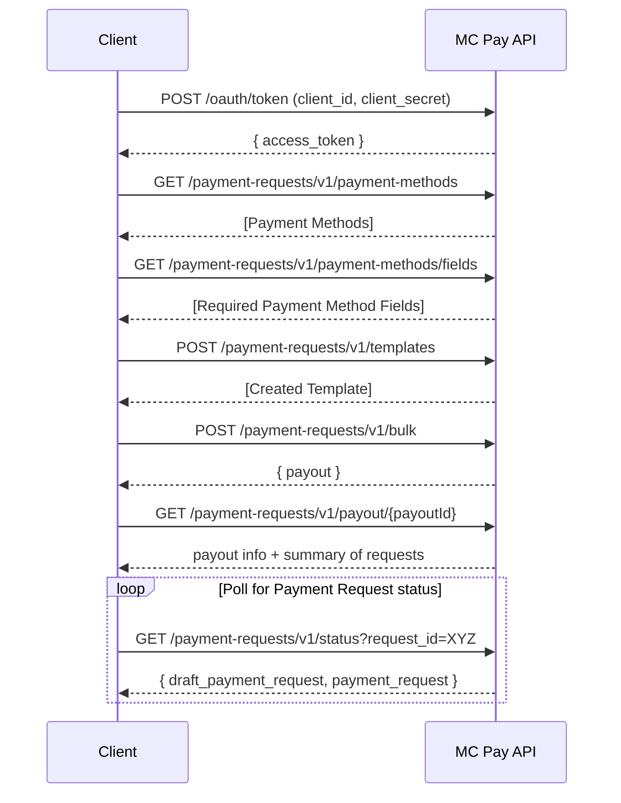

# Payment Request

[File in a different folder](OAuth.md)

The Payment Requests API allows clients to create, calculate, and track single or bulk payments.

## Authorization

All API requests require authorization using OAuth 2.0 (`partner` grant).

## Payment Request Workflow

### Single Payment Request

1. **Fetch Payment Methods**\
   `GET /payment-requests/v1/payment-methods` — Retrieve a list of available Payment Methods.

2. **Fetch Payment Method Fields**\
   `POST /payment-requests/v1/payment-methods/fields` — Retrieve required fields for the selected Payment Method.

3. **Template Creation**\
   `POST /payment-requests/v1/templates` — Create a template.

4. **Preliminary Calculation**\
   `GET /payment-requests/v1/calculate` — Calculate withdraw amount, fees, and exchange details before creating a Payment Request.\
   Returns `withdraw`, `payment`, and optionally `exchange`.

5. **Create Single Payment Request**\
   `POST /payment-requests/v1/single` — Creates a single Payment Request **synchronously**.\
   Returns `payout` and `payment_request`.
   `exchange` and `payment` appear only when `status = "success"`.

6. **Check Single Payment Request Status**\
   `GET /payment-requests/v1/status?request_id=XYZ` — Retrieve the current status of the Payment Request using its `request_id`.

### Single Payment Request Sequence

---

### Bulk Payment Request
1. **Fetch Payment Methods**\
   `GET /payment-requests/v1/payment-methods` — Retrieve a list of available Payment Methods.

2. **Fetch Payment Method Fields**\
   `POST /payment-requests/v1/payment-methods/fields` — Retrieve required fields for the selected Payment Method.

3. **Template Creation**\
   `POST /payment-requests/v1/templates` — Create a template.

4. **Preliminary Calculation**\
   `GET /payment-requests/v1/calculate` — Calculate withdraw amount, fees, and exchange details before creating a Payment Request.\
   Returns `withdraw`, `payment`, and optionally `exchange`.

5. **Create Bulk Payment Requests**\
   `POST /payment-requests/v1/bulk` (up to 50 payments) — Returns a `payout` object. Partial validation is **synchronous**; remaining checks are performed **asynchronously**.

6. **Check Single Payment Request Status**\
   `GET /payment-requests/v1/status?request_id=XYZ` — Retrieve the current status of the Payment Request using its `request_id`.

7. **Check Bulk Payout Status**\
   `GET /payment-requests/v1/payout/{payoutId}` — Retrieve the status of the payout batch and a summary of all included Payment Requests:
   - `requested` – all submitted requests
   - `pending` – requests still in progress
   - `completed` – requests that reached a final status (`success` or `error`)
   - `not_created` – requests not created due to validation or other errors

8. **Check Single Payment Request Status**\
   `GET /payment-requests/v1/status?request_id=XYZ` — Retrieve the current status of the Payment Request using its `request_id`.

> `draft_payment_request` is always created and can be used to inspect errors.\
> `exchange` and `payment` appear only for successful Payment Requests.\
> Bulk requests require polling to obtain the final status of all transactions.\
> `completed` includes all requests that reached a final status, regardless of success or failure.

### Bulk Payment Request Sequence

